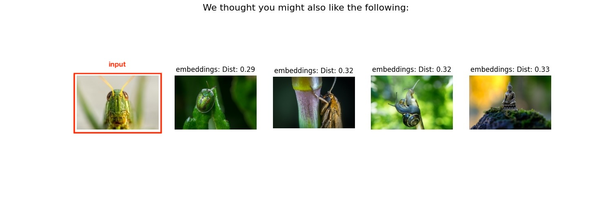
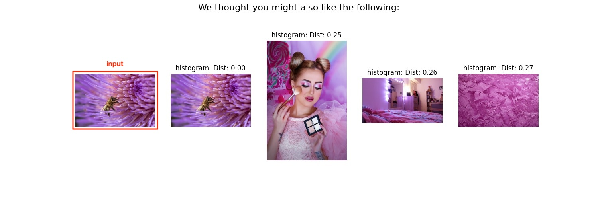
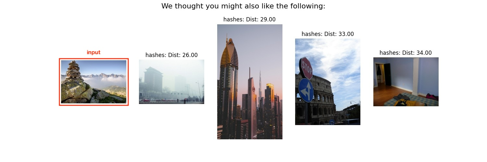

# Image Recommender

## Disclaimer
To run the code you either need the exact Data we used  or need to run the whole pipeline on your own PC (which will take approximately 72h)

## Overview

The **Image Recommender** is a Python-based application that recommends similar images to your input images based on feature extraction techniques trained on over 440k images. Users can upload images, and the system suggests visually similar images using clustering and distance metrics.

## Features

- **Methods for Feature Extraction:**
  - Embeddings (ResNet-based feature extraction)
  - Perceptual Hashing
  - Color Histograms
- **Clustering & Similarity Matching:**
  - Assigns uploaded images to a cluster using a pre-trained model.
  - Searches for the most similar images in a preprocessed dataset.
- **User-Friendly Image Selection:**
  - Currently utilizes a file dialog for easy image upload. (to be updated...)

## Installation

### Clone the Repository

```bash
git clone https://github.com/Markomrnkvc/Image_recommender_Big_Data
```

### Prerequisites

Ensure you have the following dependencies installed:

```bash
pip install -r src/requirements.txt
```

## Usage

1. **Run the script:**
   ```bash
   python main.py --mode "recommender" --method "embeddings"        
   ```
2. **Select Image(s):**
   - A file dialog will open for image selection. There is no limit to the amount of input pictures.
3. **Receive Recommendations:**
   - The system processes the images and displays similar ones.

## Example Output
  Here are examples of the recommended images based on an input image:
  
  <p align="center">
    <i>Example Results for Embeddings:</i>
    <br/>
  </p>

  <p align="center">
    <i>Example Results for Histograms:</i>
    <br/>
  </p>

  <p align="center">
    <i>Example Results for Hashes:</i><br/>
    <br/>
  </p>


## How It Works

1. **Upload an Image** – The user selects one or more images.
2. **Feature Extraction** – The system extracts features using different methods.
3. **Cluster Matching** – The uploaded image is assigned to a cluster.
4. **Similarity Measurement** – The system finds the closest images in the dataset.
5. **Results Displayed** – The most similar images are presented.


## Contributing

Contributions are welcome! Feel free to report issues.

## License

This project is licensed under the MIT License.

## Contact

For any questions, contact 
**[marie-juliette.yek@study.hs-duesseldorf.de](mailto:[marie-juliette.yek@study.hs-duesseldorf.de])** 
or 
**[marko.marinkovic@study.hs-duesseldorf.de](mailto:[marko.marinkovic@study.hs-duesseldorf.de])**.
